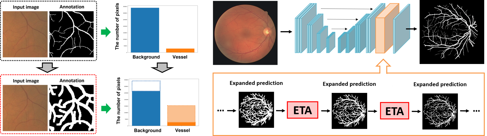
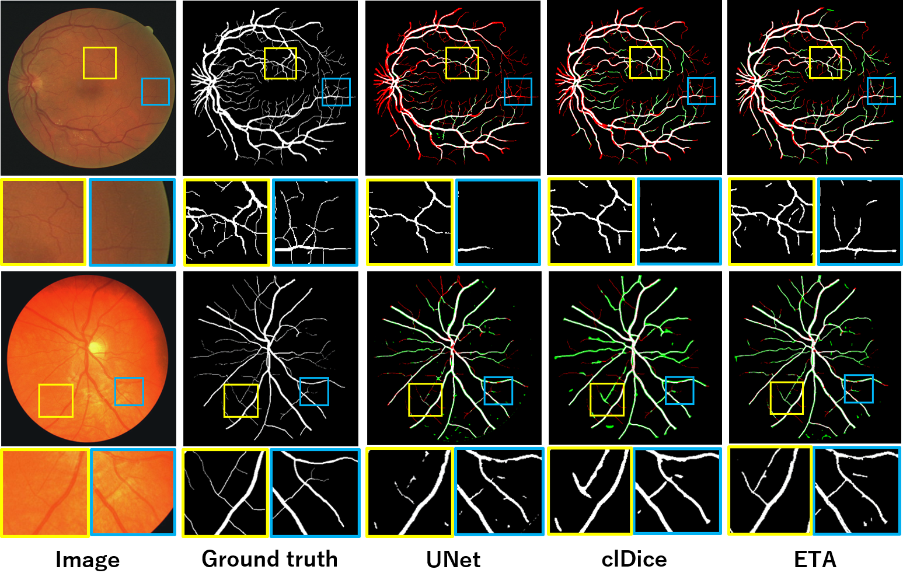

# ETA-Expanded-Tube-Attention
This repository is the official PyTorch implementation for our International Journal of Computer Assisted Radiology and Surgery (IJCARS) 2023 paper ''Expanded tube attention for tubular structure segmentation'' [[paper]](https://link.springer.com/article/10.1007/s11548-023-03038-2) (**impact factor=3.0**).


## Introduction
<div align="center">
  
</div>
**Purpose** :  Semantic segmentation of tubular structures, such as blood vessels and cell membranes, is a very difficult task, and it tends to break many predicted regions in the middle. This problem is due to the fact that tubular ground truth is very thin,
and the number of pixels is extremely unbalanced compared to the background.  
**Methods** :  We present a novel training method using pseudo-labels generated by morphological transformation. Furthermore, we present an attentionmodule using thickened pseudo-labels, called the expanded tube attention (ETA) module. By using the
ETA module, the network learns thickened regions based on pseudo-labels at first and then gradually learns thinned original regions while transferring information in the thickened regions as an attention map.  
**Results** :  Through experiments conducted on retina vessel image datasets using various evaluation measures, we confirmed that the proposed method using ETA modules improved the clDice metric accuracy in comparison with the conventional
methods.  
**Conclusions** :  We demonstrated that the proposed novel expanded tube attention module using thickened pseudo-labels can achieve easy-to-hard learning.


## Preparation for preprocessing datasets


## Training
### t-vMF Dice loss
If you prepared the dataset, you can directly run the following code to train the model.
```
python3 train.py -g 0 -o result -e 200 -b 24 -s 0 -mo unet -lo tvmf -c 2
```
### Adaptive t-vMF Dice loss
If you prepared the dataset, you can directly run the following code to train the model.
```
python3 train.py -g 0 -o result -e 200 -b 24 -s 0 -mo unet -lo Atvmf -c 2
```

## Testing
If you generated the pretrain model, you can run the following code to evaluate the model.
```
sh test.sh
```

## Results and Visualization
<div align="center">
  
</div>


## Citation
```
@article{kato2023expanded,
  title={Expanded tube attention for tubular structure segmentation},
  author={Kato, Sota and Hotta, Kazuhiro},
  journal={International Journal of Computer Assisted Radiology and Surgery},
  pages={1--7},
  year={2023},
  publisher={Springer}
}
```
